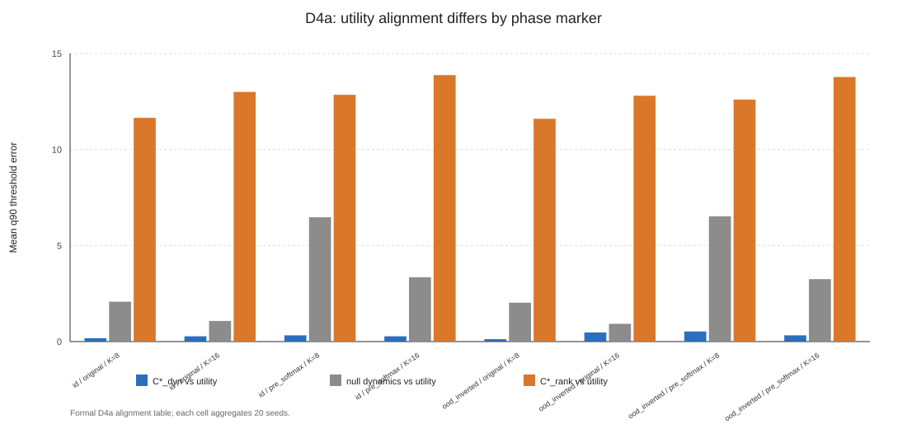
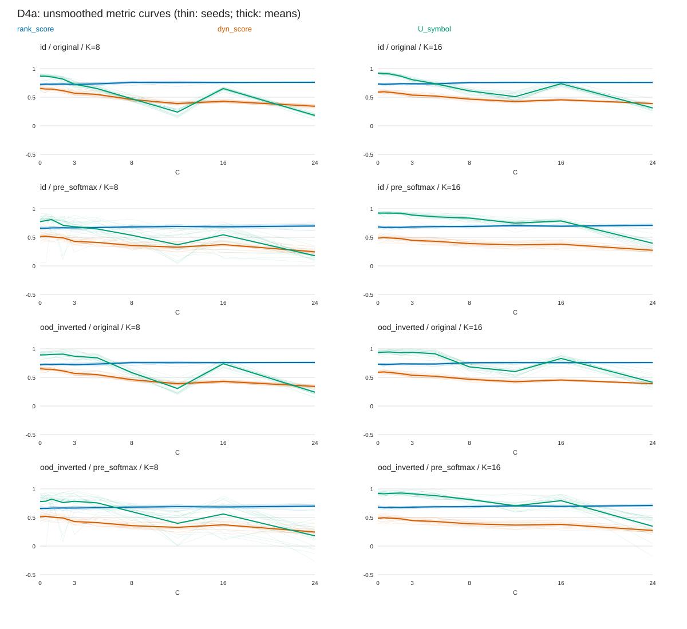
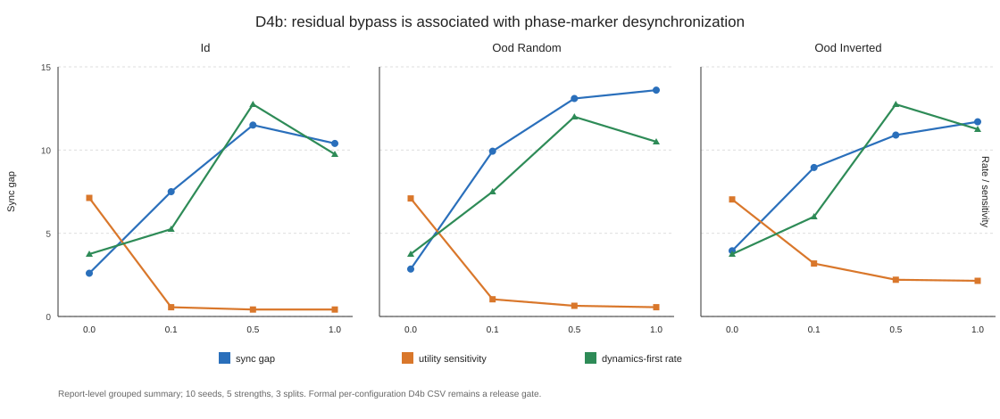
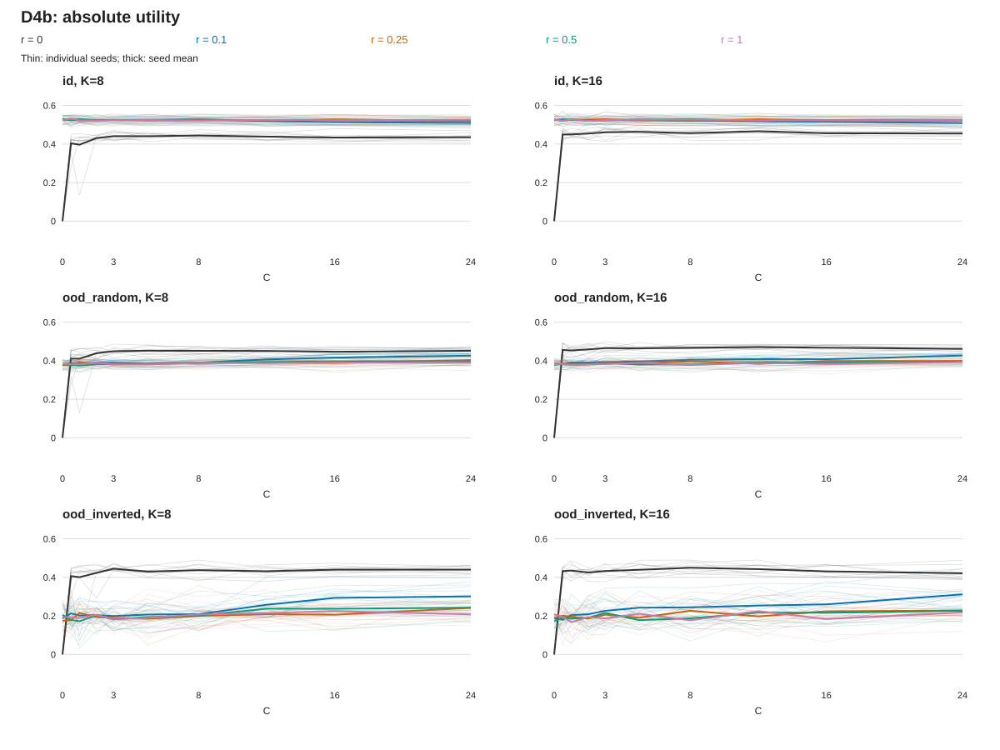
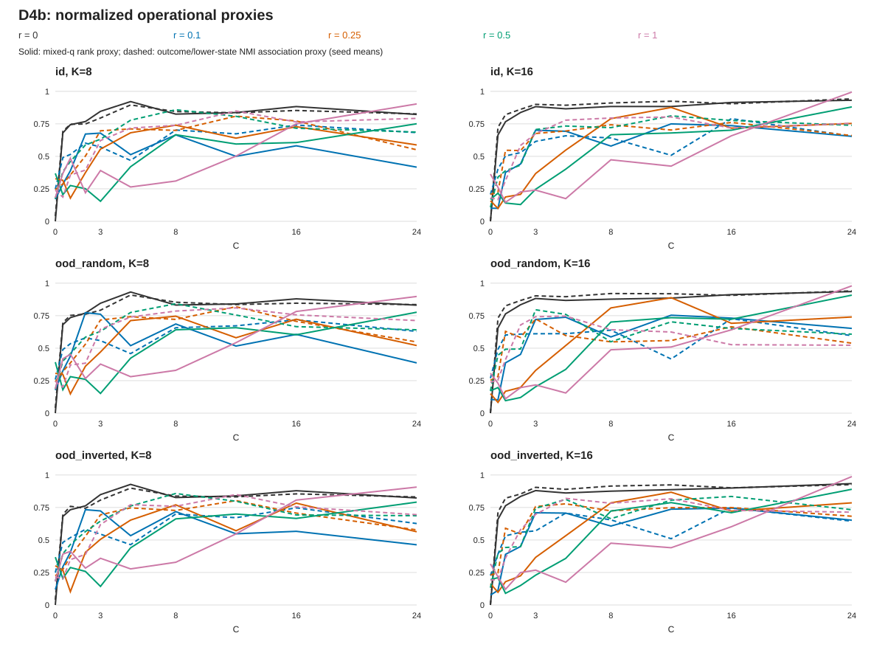

# When One Critical Coupling Is Not Enough: Residual Bypass Is Associated with Operational Marker Separation

## Abstract

A single threshold can summarize several measured properties only when their operational landmarks align. We examine this question in two related but distinct synthetic studies. D4a trains a recurrent model once per seed and representation variant, varies a control parameter in the data-generating process, and compares thresholds of representation, temporal-association and utility proxies. Across eight cells with 20 seeds each, the selected temporal proxy has mean absolute q90 threshold distance 0.3125 from utility, compared with 12.76875 for the usage/rank proxy and 3.2125 for a shuffled temporal null. The temporal proxy is closer than the usage/rank proxy in 93.75% of reported comparisons. This result is estimator-specific: a null-adjusted diagnostic has lower mean q90 error, and the slope-based comparison does not preserve the same advantage.

D4b instead retrains a discrete-bottleneck model at every control value and residual strength. Its geometry proxy measures the mixed representation, while its label-association proxy measures symbol IDs; neither proxy is identical to its D4a counterpart. In the full-grid summaries, nonzero residual conditions have larger K-balanced marker gaps (5.60–15.37 versus 1.70–2.50) and smaller utility ranges. The utility comparison includes a structural endpoint difference: at zero control and zero residual the representation is identically zero. In a post-hoc analysis excluding that endpoint, the range reduction persists for ID but reverses for OOD-inverted at residual strength 0.1 (0.182 versus 0.088). High-residual rank thresholds also frequently reach the grid boundary.

The evidence supports protocol-specific marker alignment and separation, not a common dynamics quantity across studies, a fixed-model residual intervention effect, or a demonstrated bypass mechanism. Recovered D4a raw artifacts reproduce all 960 checked q90 landmarks, but 140 of 160 utility landmarks are already at C=0. The alignment therefore does not establish coincident capability onset. Both studies now provide raw metric curves for reanalysis.

## 1. Introduction

When several readouts are intended to reflect a common change in a learned representation, one might summarize them with a shared control threshold. That is a hypothesis to check, not an implication of using the same control variable. Different readouts can vary smoothly, have different saturation scales, or respond to different parts of a system. Learning dynamics and representation analyses motivate examining these distinctions [1, 3, 4], but do not establish that the particular metrics used here should coincide.

We use “marker” for an operational landmark on a measured curve. A q90 marker does not by itself demonstrate a phase transition, a discontinuity, or emergence of a capability. Our question is whether selected markers align under their specified protocols, and how their separation varies across residual conditions. The residual-path hypothesis is motivated by the possibility that a continuous route carries useful information alongside a discrete bottleneck; residual architectures provide context [2], not evidence for this local mechanism.

D4a and D4b address related questions in different systems. D4a compares proxy alignment with utility as the synthetic data-generating process changes. D4b describes residual-associated separation under per-control retraining. D4b is not a controlled mediation experiment explaining the D4a result. Their control parameters, representations, tasks, utility scales and structural scores differ.

The contributions are an explicit comparison of operational landmarks, an estimator-qualified D4a alignment observation, and a reproducible D4b association accompanied by endpoint, missing-threshold and aggregation diagnostics.

## 2. Questions and scope

D4a asks whether a usage/rank proxy or a temporal-association proxy has a q90 landmark closer to task utility. D4b asks how the gap between a mixed-representation rank proxy and a symbol-label association proxy varies with residual strength, and how absolute utility and its grid range vary alongside it.

Within each study, write

\[
E_D=|C_D^*-C_U^*|,\qquad E_R=|C_R^*-C_U^*|,\qquad
\Delta=C_D^*-C_R^*,\qquad G=|\Delta|.
\]

Negative delta denotes an earlier D-proxy landmark, not proof of earlier acquisition of dynamics. Historical CSV names `C_rank`, `C_dyn`, `C_util`, `sync_gap` and `utility_sensitivity` are retained for reproducibility. In the prose, “rank” and “dynamics” refer only to the explicitly defined proxies below; no symbolic-equivalence relation is established.

The reported contrasts can establish descriptive differences under these protocols. They cannot establish general critical constants, equivalent measurements across D4a/D4b, causal mediation, or a fixed-trained-model residual intervention. Per-C retraining is a legitimate training-protocol estimand, but differs from changing the forward path of one fixed model. Condition-dependent random seeds and absent mechanism controls further limit the interpretation.

## 3. Methods

### 3.1 Two distinct synthetic studies

| Feature | D4a | D4b |
| --- | --- | --- |
| Meaning of C | Parameter in synthetic sequence generation | Internal mixture gate, g(C)=C/(C+2) |
| Model | GRU representation, followed by clustering/readouts | MLP encoder, discrete codebook and continuous path |
| Training | One model per seed/variant; training C sampled over [0,12) | Fresh initialization and training per seed, residual strength, K and C |
| Symbol construction | K-means on learned representations | Hard IDs from categorical logits at evaluation |
| Variants | original and pre_softmax | original in the formal run |
| Splits | ID, OOD-inverted | ID, OOD-random, OOD-inverted |
| Seeds and K | 20 seeds; K=8,16 | 10 base seeds; K=8,16 |
| Evaluation grid | 0, 0.5, 1, 2, 3, 5, 8, 12, 16, 24 | Same numerical grid, different control meaning |

In D4a, C changes terms in the synthetic latent sequence and target-generating process. A GRU is trained by mean squared error for 200 epochs with C sampled during training; evaluation then varies C and fits symbolic/readout representations. `original` uses normalized GRU states; `pre_softmax` uses softmax(ReLU(states)). The latter is not the D4b tanh-before-logits variant. Evaluation above C=12 extends beyond the training control range. In the recovered formal raw table, structural metrics use `train_mixed` for both evaluation-split labels; ID/OOD refer to the utility evaluation. Structural measurements reused across splits are not independent replications.

D4b uses a stochastic 64-state world with upper and lower components. Observations contain state embeddings, noise, time features and a spurious label channel whose relationship to the target differs by split. The four-class decision label is derived from current and future states; the outcome label is the future upper state. These labels do not drive the world transition: this is supervised sequence data, not action-conditioned closed-loop policy evaluation. OOD splits are shifts within this one world, not independent world replications.

The D4b representation is

\[
q(C,r)=g(C)q_{sym}+r[1-g(C)]q_{cont},\qquad r\in\{0,0.1,0.25,0.5,1\}.
\]

Separate heads learn decision, outcome and symbol-transition targets, with entropy regularization; C also scales symbol-usage and transition-loss coefficients during training. Thus the training contrast is not solely a forward mixture change. The formal run uses 300 training steps and batch size 512; archived configs give the remaining settings. The same base-seed datasets are reused across conditions, while initialization/training randomness is offset by C, K and residual strength. The three evaluation splits share each trained model. In particular q(0,0)=0, whereas q(0,r)=r q_cont for nonzero r.

### 3.2 Operational proxies and utility

D4a uses standardized recurrent states and K-means assignments S. Its representation proxy is

\[
R_A=0.70\,H(S)/\log K+0.30\,\mathrm{erank}(z)/d.
\]

This combines symbol usage and effective rank; neither term directly tests symbolic equivalence. Its temporal proxy is

\[
D_A=0.70[1-H(S_{t+1}\mid S_t)/\log K]+0.30\,\mathrm{NMI}(S_t,\mathrm{bin}(y_{t+1})).
\]

Future targets are quantile-binned. A null shuffles successor assignments and future-target bins; `dyn_delta` subtracts the resulting null score. The transition component measures conditional-entropy predictability, not held-out transition-model accuracy. A sequence collapsed to one symbol has zero conditional entropy and a maximal transition component despite lacking useful discrimination. Constancy of S_t alone is insufficient for that conclusion. We therefore do not interpret a high D_A as sufficient evidence of useful learned dynamics. The recovered raw table has minimum normalized usage entropy 0.755 across its 1,600 rows, excluding complete single-symbol collapse in those recorded evaluations. This does not establish that the predictability component measures useful dynamics, or rule out less extreme occupancy effects.

D4a utility is clipped normalized MSE improvement:

\[
U_A=\mathrm{clip}\left(\frac{MSE_{constant}-MSE_{symbol}}{\max(MSE_{constant}-MSE_{best},10^{-6})},-0.5,1.2\right).
\]

The constant predicts the training-target mean. The best reference is the minimum evaluation MSE among the implemented full-state, symbolic and PCA readout candidates across budgets. Thus utility is relative to that condition-specific reference, not an absolute accuracy or an independent deployment selection result.

For D4b, define N(x) as min-max normalization separately within each seed x residual x K x split curve over C. The formal proxies are

\[
R_B=N(\mathrm{erank}(q)/d),\qquad
D_B=0.60N(\mathrm{NMI}(S,outcome))+0.40N(\mathrm{NMI}(S,lower)).
\]

Here lower is a current-state component and outcome is a future-state label. The default D_B contains no transition term. R_B measures the mixed representation, including the residual, while D_B measures discrete symbol IDs. Their separation can reflect different measurement objects as well as different responses to C. Min-max normalization removes absolute component scale, so a validity gate on a normalized curve does not ensure a large raw effect.

D4b utility is normalized decision accuracy, U_B=(accuracy-majority_accuracy)/(1-majority_accuracy), with majority accuracy computed from the evaluation labels. Its historical `utility_sensitivity` field is exactly max_C U_B - min_C U_B. We call it **utility range**; it is not a derivative or local sensitivity.

### 3.3 Separate threshold estimators

D4a uses the unsmoothed curve and selects the first grid point satisfying

\[
y(C)\geq\min_C y+0.90(\max_C y-\min_C y).
\]

Its gain gate is max minus min: 0.02 for structural scores and 0.10 for utility. There is no three-point smoothing in this estimator.

D4b first smooths interior values with [0.25,0.50,0.25], leaving endpoints unchanged. It selects the first point satisfying

\[
\widetilde y(C)\geq\widetilde y(C_{min})+0.90[\max_C\widetilde y-\widetilde y(C_{min})].
\]

The smoothed gain must reach 0.05 for R_B/D_B and 0.10 for utility. Auxiliary archived `rank_valid`, `dyn_valid` and `utility_sensitive` flags use unsmoothed gains; threshold availability in this paper is determined from finite C* values, not those flags.

These algorithms differ on nonmonotone curves. Both are grid-relative landmarks, not fitted changepoints. For a finite curve passing a positive-gain gate, its maximum necessarily reaches the fractional target; invalidity comes from missing data or insufficient gain, not from failing to reach 90% of that same observed maximum. A value of 24 is a boundary hit. It indicates sensitivity to the grid extent; it does not identify a censored latent critical constant without additional assumptions. D4b smoothing is over neighboring indices despite unequal C spacing.

### 3.4 Aggregation, denominators and uncertainty

D4a reports eight split x variant x K cells, each summarizing 20 seeds. Headline values average these cell summaries. The recovered archive now permits per-seed threshold re-extraction; all 960 q90 checks across six markers and 160 landmark rows match the archived values. The source alignment table is byte-identical to the previously released one.

D4b has 1,000 trained conditions and 3,000 evaluation rows, yielding 300 seed x residual x K x split threshold rows. Neither evaluation rows nor grid points are independent training replications. Different K conditions are separately trained but share base-seed datasets; all three splits share trained models.

For each residual strength and split, archived gap means first average finite thresholds within K, then give K=8 and K=16 equal weight. They are not pooled means of all valid rows when valid counts differ. N in the main table is the sum of valid gap rows. Individual rank and D-proxy means in the K-specific table use their own finite rows, which need not be paired.

Archived sync and ordering rates use all ten planned rows within each K. An undefined gap is counted as no observed event, then the two K rates are averaged. Because each K has ten planned rows, these rates equal event counts divided by 20. Sync means |delta|<=1; negative and positive mean delta<0 and delta>0. Missing thresholds are not evidence of the opposite ordering. The supplement separately reports event counts, all-row rates, pooled-valid rates and valid counts by K; these alternate denominators do not replace the archived estimand.

Post-hoc uncertainty summaries resample the ten base seeds jointly across K and residual conditions, using 2,000 percentile-bootstrap resamples. They preserve this dependence structure but condition on one world, the grid and finite-threshold selection. They do not correct boundary effects, missingness or multiple comparisons, and are descriptive rather than confirmatory tests.

## 4. Results

### 4.1 D4a: the selected temporal proxy is closer to utility than the usage/rank proxy under q90

The eight-cell table gives mean absolute threshold distances 0.3125 for D_A, 3.2125 for its null and 12.76875 for R_A. The D_A-closer-than-R_A rate is 0.9375. Here “q90 error” means absolute distance between two q90 landmarks, not the 90th percentile of an error distribution.

| Split | Variant | K | `dyn-util` q90 error | `null-util` q90 error | `rank-util` q90 error | dyn closer rate | dyn beats null rate |
| --- | --- | ---: | ---: | ---: | ---: | ---: | ---: |
| id | original | 8 | 0.175 | 2.075 | 11.650 | 1.000 | 0.550 |
| id | original | 16 | 0.275 | 1.075 | 13.000 | 1.000 | 0.550 |
| id | pre_softmax | 8 | 0.325 | 6.475 | 12.850 | 0.950 | 0.650 |
| id | pre_softmax | 16 | 0.275 | 3.350 | 13.875 | 0.800 | 0.650 |
| ood_inverted | original | 8 | 0.125 | 2.025 | 11.600 | 1.000 | 0.550 |
| ood_inverted | original | 16 | 0.475 | 0.925 | 12.800 | 1.000 | 0.450 |
| ood_inverted | pre_softmax | 8 | 0.525 | 6.525 | 12.600 | 0.950 | 0.650 |
| ood_inverted | pre_softmax | 16 | 0.325 | 3.250 | 13.775 | 0.800 | 0.650 |

**Figure 1.** Absolute q90 landmark distances from utility, reproduced from the eight-cell alignment table. Lower values mean closer alignment under the D4a estimator.

The null has larger average error, but is not uniformly worse in rate-based comparisons. The derived null-adjusted `dyn_delta` has lower mean q90 error (about 0.219) than the selected D_A proxy. The slope-based dynamics-closer rate is about 0.456. Thus the supported comparison is D_A versus R_A under q90, not “best structural marker” or an estimator-independent predictor of utility. The recovered curves materially clarify this result: 140/160 utility q90 markers and 104/160 temporal-proxy q90 markers equal C=0. Since the estimator uses the curve minimum rather than the first point, a curve already high at C=0 can pass immediately even if it subsequently declines. A small marker distance can therefore reflect shared boundary locations rather than coincident onset of useful structure. The headline comparison remains arithmetically correct, but supports only landmark alignment under this definition.

**Figure 2.** Recovered D4a unsmoothed curves: individual seeds (thin) and cell means (thick). The usage/rank and temporal proxies are measured on train_mixed; utility is evaluated on the indicated split. Their vertical scales have different definitions and are not interchangeable performance units. The curves should not be interpreted as a common monotone emergence trajectory.

### 4.2 D4b: residual-associated marker separation on the original grid

The table retains the archived K-balanced means and all-row event rates defined in Section 3.4. Historical dynamics-first terminology means D_B-proxy-first only.

| Residual strength | Split | N valid / 20 | `sync_gap` | Sync rate | Utility range | Negative-delta rate (all rows) |
| ---: | --- | ---: | ---: | ---: | ---: | ---: |
| 0.0 | id | 20 | 1.700 | 0.70 | 0.470 | 0.35 |
| 0.0 | ood_random | 20 | 2.350 | 0.50 | 0.477 | 0.30 |
| 0.0 | ood_inverted | 20 | 2.500 | 0.55 | 0.466 | 0.25 |
| 0.1 | id | 20 | 5.600 | 0.40 | 0.030 | 0.25 |
| 0.1 | ood_random | 20 | 7.825 | 0.30 | 0.058 | 0.50 |
| 0.1 | ood_inverted | 20 | 7.225 | 0.30 | 0.186 | 0.45 |
| 0.25 | id | 19 | 6.939 | 0.10 | 0.025 | 0.60 |
| 0.25 | ood_random | 20 | 8.050 | 0.20 | 0.042 | 0.60 |
| 0.25 | ood_inverted | 19 | 5.617 | 0.25 | 0.140 | 0.55 |
| 0.5 | id | 19 | 11.322 | 0.05 | 0.026 | 0.85 |
| 0.5 | ood_random | 20 | 12.550 | 0.10 | 0.039 | 0.80 |
| 0.5 | ood_inverted | 19 | 10.139 | 0.00 | 0.154 | 0.85 |
| 1.0 | id | 20 | 12.350 | 0.20 | 0.021 | 0.70 |
| 1.0 | ood_random | 19 | 15.372 | 0.05 | 0.036 | 0.80 |
| 1.0 | ood_inverted | 20 | 13.750 | 0.05 | 0.151 | 0.80 |

**Figure 3.** Archived K-balanced gap, utility range and all-row negative-delta rate. Gap uses the left axis; range and rate use the right axis. Missing threshold rows are excluded from gap means but retained in event-rate denominators.

On the complete grid, the nonzero-residual gap means range from 5.60 to 15.37, versus 1.70 to 2.50 at zero residual. Ordering is not uniformly monotone: OOD-inverted gap declines from r=0.1 to 0.25, and the ID negative-delta rate declines from 0.85 at r=0.5 to 0.70 at r=1. At r=0.5 in ID, 17 of 20 planned rows have negative delta, while 19 have finite gaps: the archived rate is 0.85, and the separately labeled pooled-valid rate is 17/19=0.895.

Rank thresholds hit 24 in 3.3%, 25.0%, 21.7%, 60.0% and 76.7% of all seed x K x split rows as r increases. Large high-residual gaps must be interpreted with these boundary hits and the unequal spacing of the grid. They do not quantify the separation of continuous, uncensored critical points.

At r=0, utility thresholds are finite in all 20 rows per split. At nonzero r they are finite in 0/20 ID and 0/20 OOD-random rows. OOD-inverted counts are 13/20, 6/20, 6/20 and 1/20. Accordingly, the residual comparison primarily concerns two proxies and utility range; it is not a complete three-threshold ordering at every condition.

### 4.3 K-specific marker locations

| Residual strength | K | ID | OOD random | OOD inverted |
| ---: | ---: | --- | --- | --- |
| 0.0 | 8 | 3.00 vs 4.40 | 3.10 vs 4.30 | 3.10 vs 5.10 |
| 0.0 | 16 | 5.00 vs 4.20 | 6.00 vs 4.50 | 6.20 vs 4.40 |
| 0.1 | 8 | 10.40 vs 11.60 | 10.80 vs 9.50 | 9.80 vs 9.90 |
| 0.1 | 16 | 12.40 vs 12.40 | 13.10 vs 9.35 | 12.20 vs 9.85 |
| 0.25 | 8 | 10.40 vs 7.56 | 10.30 vs 7.10 | 10.40 vs 7.11 |
| 0.25 | 16 | 14.40 vs 12.70 | 12.80 vs 9.10 | 14.80 vs 11.30 |
| 0.5 | 8 | 19.11 vs 9.30 | 18.00 vs 9.40 | 18.67 vs 9.90 |
| 0.5 | 16 | 20.40 vs 10.00 | 20.80 vs 7.50 | 17.60 vs 8.90 |
| 1.0 | 8 | 21.20 vs 16.80 | 20.40 vs 12.30 | 19.60 vs 13.20 |
| 1.0 | 16 | 24.00 vs 7.70 | 22.80 vs 3.22 | 23.20 vs 7.70 |

Entries are mean C_R* versus mean C_D*, calculated separately over each marker's finite rows. They are descriptive locations, not paired differences. The K-balanced gap in Section 4.2 is computed from within-row absolute differences before averaging and cannot be recovered by subtracting these means.

### 4.4 Post-hoc endpoint sensitivity and absolute curves

At C=0, the zero-residual model receives q=0 while nonzero-residual models retain a continuous path. The full-grid utility-range contrast therefore includes a structural difference at its endpoint. We retain that original contrast and separately recompute each seed x K range on C>0, then apply the same K-balanced averaging. This is a post-hoc sensitivity analysis; it does not alter the archived markers or retrospectively become a prespecified test.

| r | Split | Full-grid utility range | C>0 utility range |
| ---: | --- | ---: | ---: |
| 0 | id | 0.470 | 0.065 |
| 0 | ood_random | 0.477 | 0.064 |
| 0 | ood_inverted | 0.466 | 0.088 |
| 0.1 | id | 0.030 | 0.030 |
| 0.1 | ood_random | 0.058 | 0.057 |
| 0.1 | ood_inverted | 0.186 | 0.182 |
| 0.25 | id | 0.025 | 0.025 |
| 0.25 | ood_random | 0.042 | 0.040 |
| 0.25 | ood_inverted | 0.140 | 0.126 |
| 0.5 | id | 0.026 | 0.024 |
| 0.5 | ood_random | 0.039 | 0.038 |
| 0.5 | ood_inverted | 0.154 | 0.150 |
| 1 | id | 0.021 | 0.020 |
| 1 | ood_random | 0.036 | 0.035 |
| 1 | ood_inverted | 0.151 | 0.148 |

In ID, r=0 has mean U(0)=0 and U(24)=0.445, whereas r=0.1 has approximately 0.526 and 0.509. Excluding C=0 reduces the zero-residual range to 0.065. The range remains lower at r=0.1 in ID (0.030), but is higher in OOD-inverted (0.182 versus 0.088). Thus “all nonzero groups have lower utility range” describes the original full grid, not a robust statement across endpoint choices. This finding is compatible with useful bypass information but cannot independently establish a desynchronization mechanism.

**Figure 4.** Unsmoothed absolute utility by C, split and K. Thin lines are individual seeds; thick lines are seed means. Lines connect discrete evaluations and do not imply continuous fitted transitions. Utility is not normalized separately along these curves.

**Figure 5.** Unsmoothed means of per-curve normalized R_B (solid) and D_B (dashed), with identical color coding to Figure 3. Averaged curves are descriptive; thresholds are extracted per seed after the specified smoothing, not from these mean curves. The plot does not establish sharp phase transitions.

The supplement provides all 15 range comparisons, absolute endpoint values, denominator diagnostics and post-hoc seed-bootstrap intervals for residual-versus-zero gap and positive-C range contrasts. No D4a raw curves have been synthesized from aggregate means.

## 5. Interpretation and limitations

The evidence demonstrates disagreement among specified operational landmarks. It does not show that representation equivalence, useful dynamics and utility emerge at distinct physical phase transitions. Different measurement objects, relative normalization, grid spacing, validity gates and training protocols all contribute to what the landmarks mean.

D4a's q90 alignment advantage is a comparison among proxies in a recurrent synthetic prediction task. Its entropy-based component can reward degenerate predictability; a future-label MI term also makes the proxy task-related rather than purely unsupervised. Aggregate alignment alone cannot identify what causes the advantage. The lower error of the null-adjusted diagnostic and the different slope-based result are material qualifications.

D4b is a separate observation: a mixed-q rank marker and a symbol-label association marker separate more in nonzero-residual conditions on the selected grid. The two readouts measure different objects, and the high-residual rank marker frequently reaches the grid boundary. A bypass mechanism is one possible interpretation, not an identified cause. Low full-grid utility range is partly explained by an already useful nonzero-residual endpoint, and the endpoint-exclusion result shows that its direction depends on split.

Retraining is not inherently a flaw: it measures the outcome of the chosen training protocol. It cannot answer a fixed-model forward-path intervention question. D4b also uses condition-dependent initialization seeds, and nominal residual strength does not by itself measure the magnitude or semantic content of the learned residual path. Fixed-model probes and magnitude-matched residual controls would answer different, stronger questions.

Both studies are synthetic and the D4b OOD splits come from one constructed world. Ten base seeds give limited uncertainty information. Missing thresholds may be informative, and neither finite-only means nor bootstrapping resolves that selection. D4a raw metric curves and landmarks were recovered during this revision; they do not include every underlying sample-level representation or symbol assignment. The raw-data and reproducibility limits are separate from the scientific interpretation limits.

## 6. Existing diagnostics and targeted follow-up

The archived 16-cell frozen-model D4b probe found zero gain in the original D_B score: hard symbol IDs are C-invariant after weights are frozen. This is an estimand limitation, not evidence that fixed-model dynamics is absent. A second two-seed, one-K probe uses a transition head consuming q(C) and yields finite landmarks, but its nonmonotone pattern and absent residual null do not establish a formal intervention effect. It measures a different proxy and is not a replication of D_A or D_B.

The original D4a artifacts have been recovered without retraining. The lowest-cost next steps are clearly labeled sensitivity analyses of the existing curves, especially distinguishing first-grid attainment from an interior upward crossing in D4a. Neighboring threshold fractions, unsmoothed estimates and extended-grid data would test different sources of estimator dependence; changing grid extent would require additional data, whereas the first two checks do not.

A prospective stronger study should specify its measurement object and outcome before collecting data, then use common random numbers and magnitude-matched residual shuffles where appropriate. A fixed-model study must first choose a genuinely C-dependent readout. If such a different estimand aligns its markers, that would limit generalization of the current interpretation; it would not retroactively invalidate the descriptive per-C retraining result. If shuffled residuals reproduce the separation, the semantic-bypass interpretation should be weakened.

These are proposed tests, not claimed preregistered falsifiers. No new training was performed for this revision.

## 7. Reproducibility

| Purpose | Artifact |
| --- | --- |
| D4a implementation and model | `source/d2_d4_protocol.py`, `source/experiment_D_pytorch_history_symbol_budget.py` |
| D4b implementation | `source/d4b_residual_desync_gpu.py` |
| Archived protocol and commands | `source/D4_PROTOCOL.md` |
| D4a aggregate alignment | `results/d4a_repair_alignment.csv` |
| Recovered D4a raw curves, landmarks and source hashes | `results/d4a_formal_archive/` |
| D4a threshold verification and Figure 2 | `repro/verify_d4a_archive.py` |
| D4b raw curves, thresholds, configs and provenance | `results/d4b_formal_gpu/` |
| Archived integrated report | `results/D4_integrated_report.md` |
| Frozen-model diagnostics | `results/fixed_model_sweep_probe/`, `results/fixed_model_sweep_transition_probe/` |
| Revision analysis and source hashes | `results/revision_posthoc/` |
| Revision reanalysis script | `repro/revision_posthoc.py` |
| Claim boundaries | `CLAIMS_AND_LIMITS.md` |

Run `python repro/audit_claim_numbers.py` to check the archived headline numbers and release shape. Run `python repro/revision_posthoc.py` to regenerate the post-hoc tables and Figures 4–5 using only Python's standard library. Source hashes and exploratory status are recorded in `results/revision_posthoc/provenance.json`. Neither command retrains models. The artifact checks verify only their encoded properties, not causal or construct validity.

D4b provides raw curves for threshold recomputation. Following the recorded source archive path in `SOURCES.md` recovered 1,600 D4a raw rows and 160 landmark rows. The original eight-cell alignment file has the same SHA-256 hash as the repository copy. `python repro/verify_d4a_archive.py` independently recomputes six q90 markers per row and checks the cell-level distance summaries; it also regenerates Figure 2. The recovery preserves original bytes and does not rerun training. It verifies these recorded metrics, not the original sample-level metric generation. Archived reports retain historical terminology; this manuscript and `CLAIMS_AND_LIMITS.md` state the current interpretation.

## 8. Conclusion

The two synthetic studies support protocol-specific comparisons of operational proxies. In D4a, the selected temporal-association landmark is closer to utility than the usage/rank landmark under q90, with most utility landmarks already at the first grid point. In D4b, nonzero residual conditions accompany larger K-balanced rank/label-association gaps on the original grid. Lower full-grid utility range is endpoint-sensitive and does not persist in direction across all splits after excluding C=0.

These observations motivate measuring and reporting separate landmarks instead of assuming one common threshold. They do not establish equivalent dynamics measurements across studies, symbolic equivalence, a fixed-model intervention effect, or a residual-bypass mechanism.

## References

1. A. M. Saxe, J. L. McClelland, and S. Ganguli, “Exact solutions to the nonlinear dynamics of learning in deep linear neural networks,” arXiv:1312.6120, 2013. https://arxiv.org/abs/1312.6120
2. K. He, X. Zhang, S. Ren, and J. Sun, “Deep residual learning for image recognition,” arXiv:1512.03385, 2015; published in CVPR 2016. https://arxiv.org/abs/1512.03385
3. N. Tishby and N. Zaslavsky, “Deep learning and the information bottleneck principle,” arXiv:1503.02406, 2015. https://arxiv.org/abs/1503.02406
4. M. Raghu, J. Gilmer, J. Yosinski, and J. Sohl-Dickstein, “SVCCA: Singular vector canonical correlation analysis for deep learning dynamics and interpretability,” arXiv:1706.05806, 2017. https://arxiv.org/abs/1706.05806
